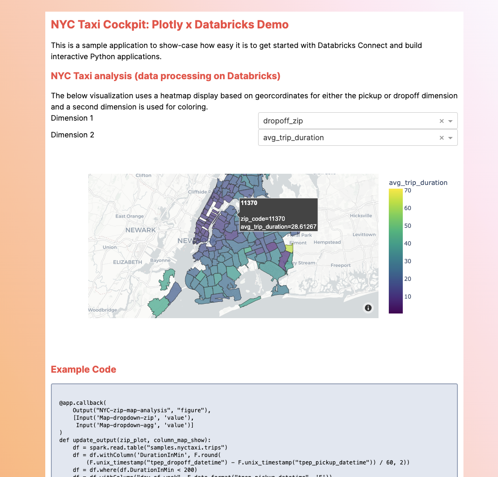

# Databricks Connect x Plotly

This is a sample app on how to show how easy it is to build a new application
using Databricks Connect and Plotly. All you need to get started is a Databricks
cluster and this simple Python application. The dataset used in this application
is the standard Databricks `samples` dataset.

To get started, create a new virtual environment and install the reuired
dependencies

```commandline
pip instal -r requirements.txt
```

```python
from databricks.connect.session import DatabricksSession as SparkSession
from databricks.sdk import WorkspaceClient

config = WorkspaceClient(profile="PROFILE", cluster_id="CLUSTER_ID").config
spark = SparkSession.builder.sdkConfig(config).getOrCreate()
```


In the app.py file configure the values for `HOST`, `CLUSTER` and `TOKEN` with
correct values that identify your Databricks workspace, cluster ID and your personal
access token.

Run the plotly app

```shell
python app.py
```




## Dependencies

This sample application is meant for illustration purposes only. The
application uses the follwing third-party dependencies:

  * Plotly / Dash - https://github.com/plotly/dash - The MIT License (MIT)
  * Tailwind CSS - https://github.com/tailwindlabs/tailwindcss - - The MIT License (MIT)